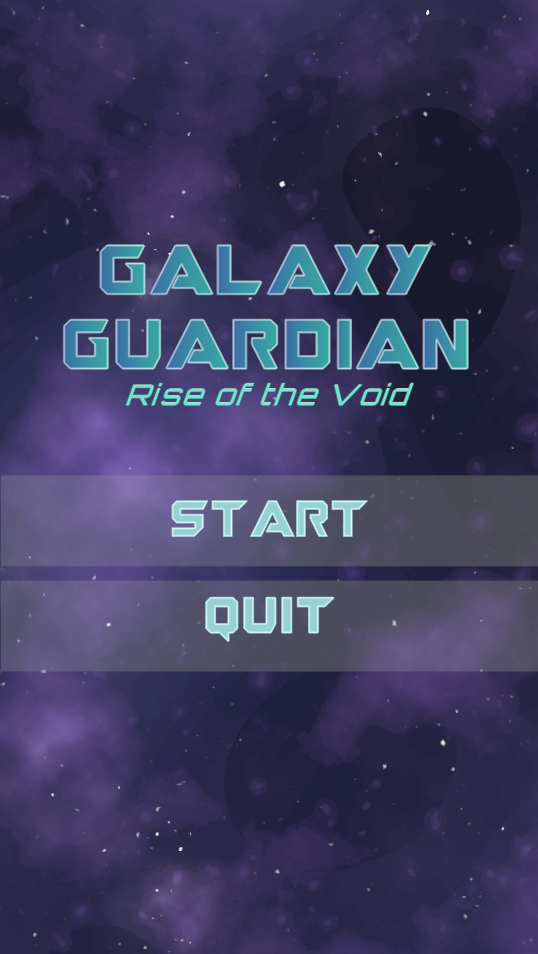
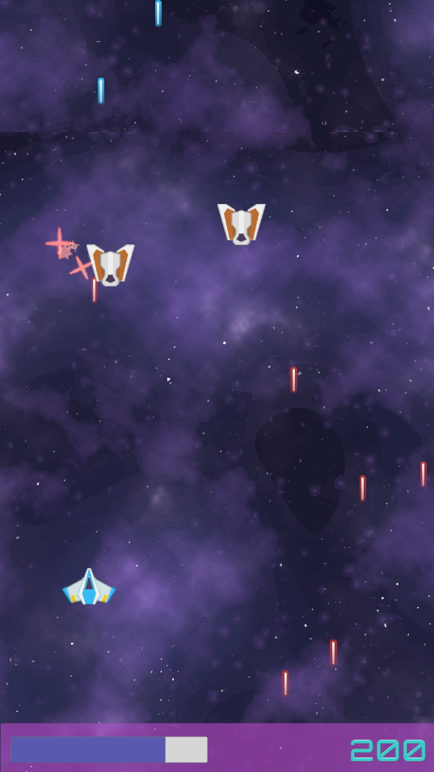
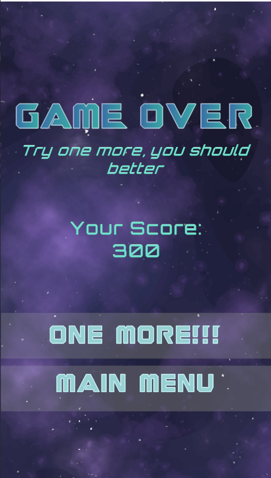


# 🚀 Galaxy Guardian

**Galaxy Guardian** là một game 2D thể loại *Space Shooter* do cá nhân phát triển bằng Unity. Người chơi vào vai một Vệ binh Ngân Hà điều khiển tàu vũ trụ, chiến đấu chống lại các đợt tấn công không ngừng nghỉ của kẻ địch ngoài hành tinh.

---

## 📌 Thông tin chung

- 🎮 **Thể loại:** Space Shooter, Casual
- 🛠 **Công nghệ sử dụng:** Unity 2D, C#, Particle System, AudioSource, Canvas UI  
- 🖥 **Nền tảng:** PC (Windows)

---

## 🎯 Mục tiêu dự án

- Tự học và luyện tập kỹ năng phát triển game bằng Unity
- Ứng dụng lập trình C# trong môi trường thực tế
- Thể hiện sản phẩm cá nhân trong CV khi ứng tuyển thực tập vị trí Unity Developer

---

## 🧩 Gameplay

- Người chơi điều khiển tàu vũ trụ di chuyển và bắn đạn để tiêu diệt kẻ địch 
- Enemy xuất hiện ngẫu nhiên từ phía trên và ngày càng dày đặc
- Mỗi enemy tiêu diệt được sẽ tăng điểm số
- Trò chơi kết thúc khi người chơi mất hết máu (mạng sống)

---

## 🧠 Tính năng chính

- 🎮 Điều khiển bằng bàn phím a, s, d, w hoặc nút mũi tên
- 💥 Bắn đạn bằng chuột trái, va chạm và hiệu ứng nổ bằng Particle System
- 👾 Enemy đa dạng, được spawn tự động
- 📊 Giao diện người dùng (UI): điểm số, mạng sống, màn hình Game Over
- 🔊 Âm thanh hành động: bắn, trúng đạn, nổ, nhạc nền

---

## 📷 Hình ảnh demo

---
## 🚀 Cách cài đặt
- B1: Clone repo về máy
- B2: Mở bằng Unity
- B3: Chạy Scene MainMenu hoặc build để chơi